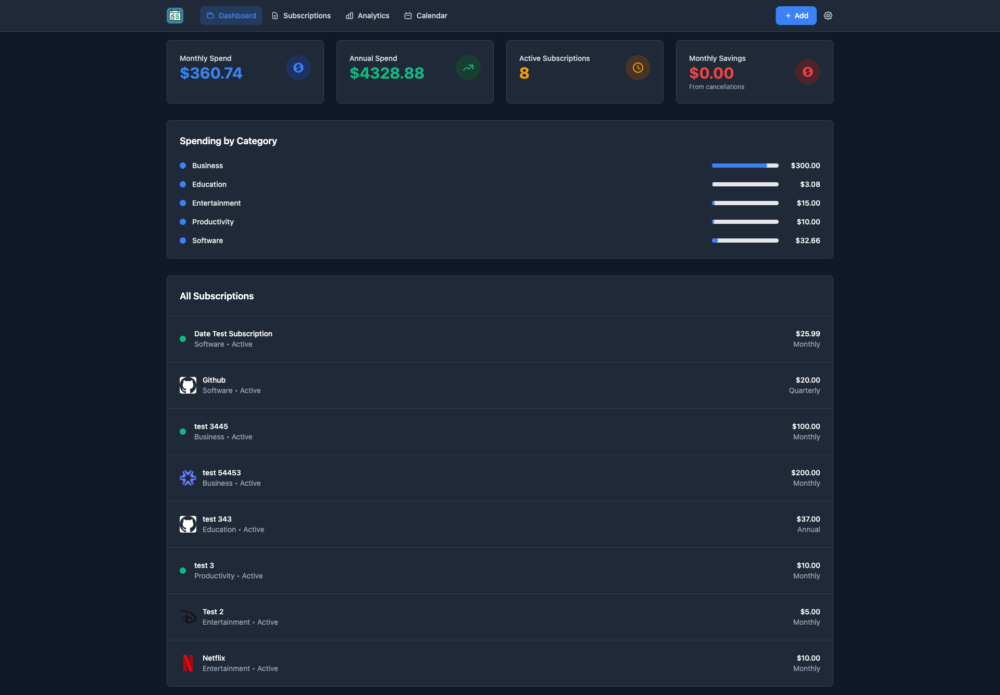
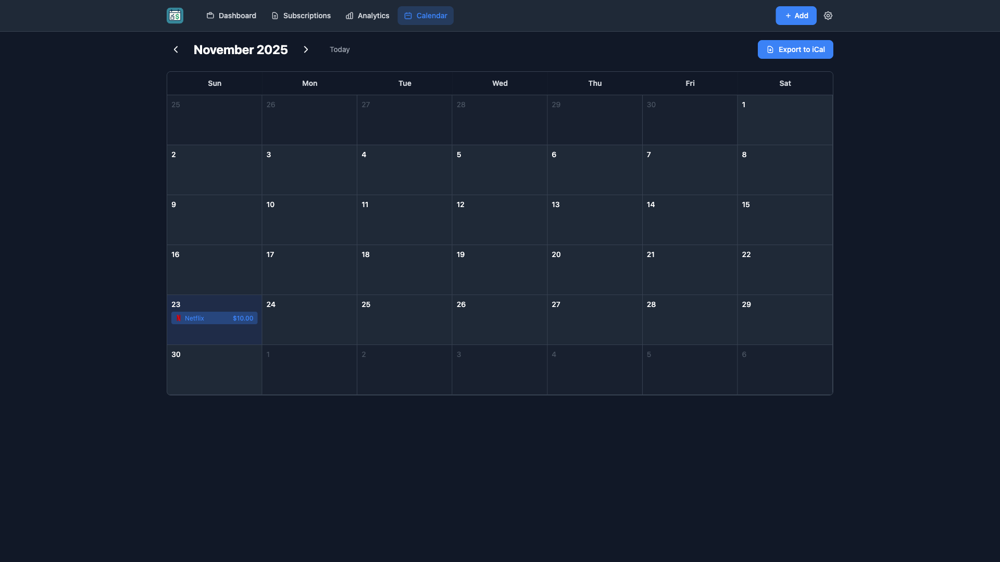
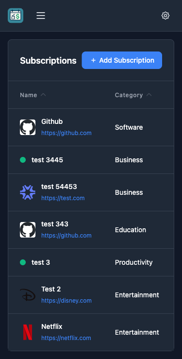

# yyTrackr

`yyTrackr` is a self-hosted subscription tracker built on the original `bscott/subtrackr` stack and kept intentionally simple:

- Go + Gin
- SQLite
- HTMX templates
- Tailwind CSS

This fork adds a polished anime / gal-style dashboard, mandatory account login, Telegram / Webhook / Email notifications, multi-user data isolation, and a bundled visual preset so the app looks complete on first launch.





## Features

- Multi-user account system with registration and login
- Dashboard, subscriptions, analytics, calendar, and settings pages
- Glassmorphism `Gal Violet` theme with bundled chibi stickers
- Email, Telegram, Pushover, and Webhook notifications
- iCal subscription feed for renewal dates
- CSV / JSON / iCal export
- Per-subscription original currency tracking
- Dashboard and analytics totals converted to your chosen display currency
- Automatic exchange rates via `Frankfurter` without an API key
- Local development preview mode

## Screens and Assets

This repository intentionally includes the bundled UI assets used by the current theme:

- chibi sticker assets in [`web/static/images/chibi`](web/static/images/chibi)
- wallpaper assets in [`web/static/images/wp`](web/static/images/wp)

That means a fresh clone can run with the same visual presentation shown in the screenshots.

## Quick Start

### Requirements

- Go `1.21+`

### Run locally

```bash
go mod tidy
go run .
```

Then open:

```text
http://localhost:8080
```

If your module download is slow, you can temporarily set a Go proxy:

```bash
export GOPROXY=https://proxy.golang.org,direct
go mod tidy
go run .
```

PowerShell:

```powershell
$env:GOPROXY="https://proxy.golang.org,direct"
go mod tidy
go run .
```

`yyTrackr` automatically creates:

- `./data/`
- `./data/subtrackr.db`

## Default Runtime Behavior

- Default port: `8080`
- Startup log: `Server running at http://localhost:8080`
- Authentication is required for the web UI
- Each account has isolated subscriptions, categories, settings, and API keys

## Configuration

Environment variables are optional unless you want to customize behavior.

| Variable | Description | Default |
| --- | --- | --- |
| `PORT` | Server port | `8080` |
| `DATABASE_PATH` | SQLite database file path | `./data/subtrackr.db` |
| `DB_PATH` | Alias for `DATABASE_PATH` | `./data/subtrackr.db` |
| `GIN_MODE` | Gin mode | `debug` |
| `DEV_PREVIEW` | Show styled empty-state preview blocks | `false` |

### Example

```bash
PORT=8080
DATABASE_PATH=./data/subtrackr.db
GIN_MODE=release
DEV_PREVIEW=false
```

PowerShell:

```powershell
$env:PORT="8080"
$env:DATABASE_PATH="./data/subtrackr.db"
$env:GIN_MODE="release"
$env:DEV_PREVIEW="false"
go run .
```

## Notifications

Notification channels are configured in the Settings page:

- SMTP Email
- Telegram Bot
- Pushover
- Generic Webhook

### Renewal reminder timing

Current scheduler behavior:

- one catch-up scan about `15 seconds` after startup
- then a daily scan at `10:00` local time on the machine running the server

If a subscription renews tomorrow and the reminder lead time is set to `1` day, the reminder is sent today during the `10:00` scan.

## Currency Behavior

- In `Subscriptions`, each item keeps its original currency
- In `Dashboard` and `Analytics`, totals are converted into the display currency selected in Settings
- Exchange rates come from `Frankfurter`
- No API key is required

## Development Notes

### DEV preview mode

Enable placeholder UI blocks without injecting fake subscription records:

```bash
DEV_PREVIEW=true
go run .
```

### SQLite driver

This fork uses a pure-Go SQLite driver so local preview works without CGO.

## Production Notes

- Run behind a reverse proxy if you need HTTPS and domain routing
- Set the machine timezone correctly because reminder jobs use the server's local time
- Make regular backups of the `data/` directory

## Open Source Publishing Checklist

Before pushing your own public repo, do not commit:

- `data/`
- `*.db`
- real SMTP passwords
- Telegram bot tokens
- Discord / webhook URLs
- generated API keys
- local logs

The included `.gitignore` is already set up to ignore the main runtime and secret-prone local files.

## Project Structure

```text
.
├─ cmd/
├─ internal/
├─ templates/
├─ web/
│  └─ static/
│     ├─ css/
│     ├─ images/
│     │  ├─ chibi/
│     │  └─ wp/
│     └─ js/
├─ data/
├─ main.go
└─ README.md
```

## License

This fork continues from the original SubTrackr project. Review the upstream license and keep attribution consistent with the original repository when publishing your fork.
